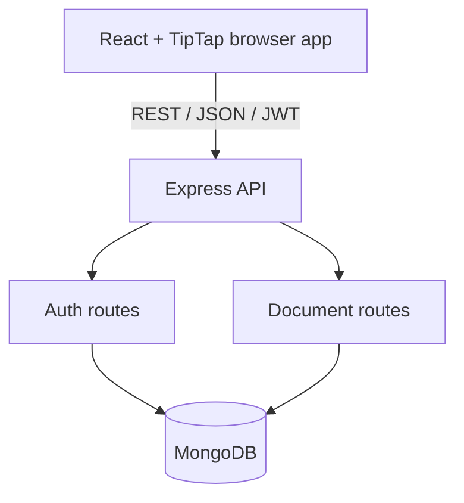
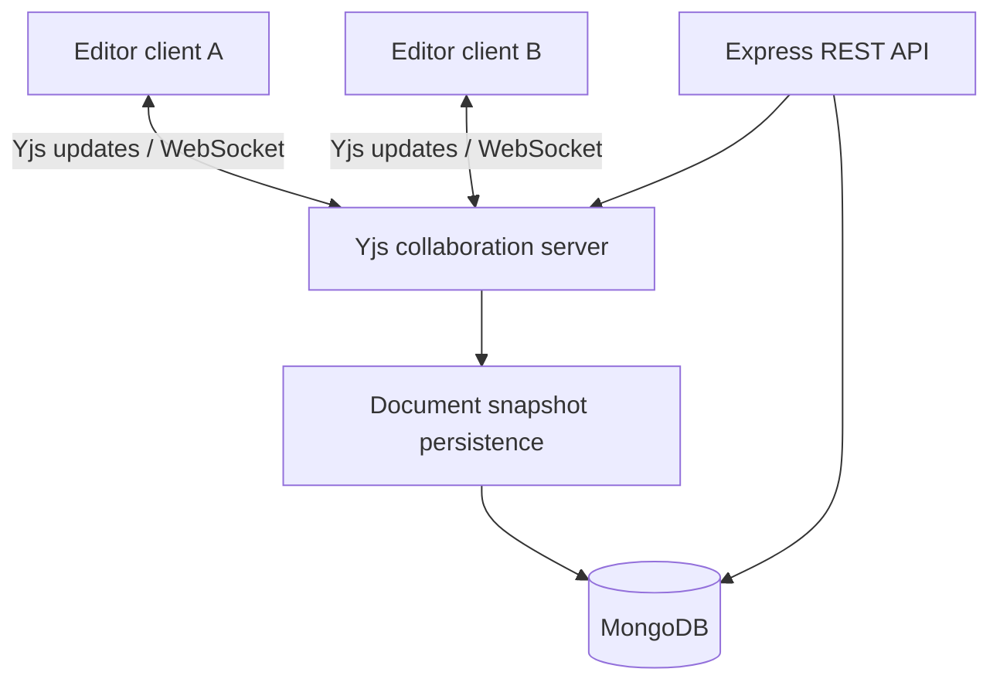

# Architecture

## Current implementation

```mermaid
flowchart TD
  Browser[React + TipTap browser app] -->|REST / JSON / JWT| Express[Express API]
  Express --> Auth[Auth routes]
  Express --> Documents[Document routes]
  Auth --> Mongo[(MongoDB)]
  Documents --> Mongo
```

## Planned real-time architecture

```mermaid
flowchart TD
  A[Editor client A] <-->|Yjs updates / WebSocket| WS[Yjs collaboration server]
  B[Editor client B] <-->|Yjs updates / WebSocket| WS
  WS --> Persistence[Document snapshot persistence]
  Persistence --> DB[(MongoDB)]
  API[Express REST API] --> DB
  API --> WS
```

The planned diagram is aspirational; the current project does not yet run a Yjs WebSocket server.
